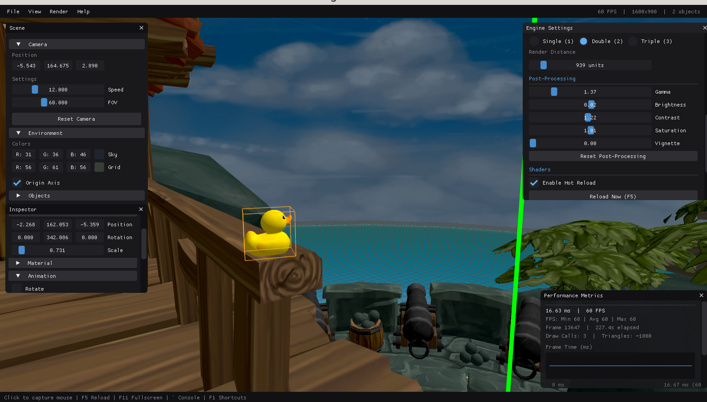

# euengine

SDL3 GPU engine with hot-reload architecture.

## Key Technologies


### Core Libraries

- **[SDL3](https://github.com/libsdl-org/SDL)** - Window management, events, and GPU abstraction
- **[SDL3 GPU](https://github.com/libsdl-org/SDL_gpu)** - Vulkan backend via SDL3 GPU API
- **[SDL3_mixer](https://github.com/libsdl-org/SDL_mixer)** - Audio playback and mixing
- **[SDL3_shadercross](https://github.com/libsdl-org/SDL_shadercross)** - Cross-platform shader compilation

### Graphics & Rendering

- **[fastgltf](https://github.com/spnda/fastgltf)** - Fast GLTF/GLB model loading
- **[tinygltf](https://github.com/syoyo/tinygltf)** - Alternative GLTF loader
- **[GLM](https://github.com/g-truc/glm)** - OpenGL Mathematics library
- **[stb](https://github.com/nothings/stb)** - Image loading utilities

### Game Development

- **[EnTT](https://github.com/skypjack/entt)** - Fast and modern ECS framework
- **[ImGui](https://github.com/ocornut/imgui)** - Immediate mode GUI
- **[pybind11](https://github.com/pybind/pybind11)** - Python scripting support

### Tools & Utilities

- **[spdlog](https://github.com/gabime/spdlog)** - Fast C++ logging library
- **[Tracy](https://github.com/wolfpld/tracy)** - Real-time performance profiler
- **[yaml-cpp](https://github.com/jbeder/yaml-cpp)** - YAML configuration parser

## Why not Unity/Godot/Unreal?

**Minimalist.** No editor bloat, no hidden complexity. Engine and game are cleanly separated.

**Hot reload.** Edit code, press F5. Game logic reloads without restart. Shaders reload automatically.

**Fast iteration.** `game.so` and `engine.exe` architecture means you rebuild only what changed. Engine stays running.

**SDL3 callbacks.** Modern event-driven design, not legacy game loops.

**Vulkan via SDL3 GPU.** Low-level control without Vulkan boilerplate.

**GLTF workflow.** Model in Godot, export GLTF, load directly. Use Godot as your front-end editor.

## Architecture

```
engine.exe  →  game.so
   ↑              ↓
   └──────────────┘
   hot reload
```

Engine runs as executable. Game logic lives in shared library. Reload game without restarting engine.

## Hot Reload

- **Game code**: Press F5 to reload `game.so`
- **Shaders**: Auto-reload on file change
- **Assets**: Rescan without restart

## GLTF Support

Full GLTF/GLB import. Model in Godot, export, load directly. Engine handles rendering, physics, and game logic.

## Planned Features

### Steam Audio Integration

Planned support for **[Steam Audio](https://valvesoftware.github.io/steam-audio/)** - Valve's spatial audio solution providing:

- **3D spatial audio** - Realistic sound propagation and occlusion
- **HRTF (Head-Related Transfer Function)** - Binaural audio for headphones
- **Reflection and reverb** - Physics-based acoustic simulation
- **Occlusion and obstruction** - Dynamic sound blocking by geometry

This will enhance the audio subsystem with professional-grade spatial audio capabilities for immersive game experiences.

## Building

```bash
cmake --preset clang
cmake --build --preset clang
```

## Development

Install pre-commit hooks:

```bash
pip install pre-commit
pre-commit install
```

Hooks run on commit:
- **clang-format** - C++ code formatting (auto-fixes)
- **gersemi** - CMake formatting (auto-fixes)

Run clang-tidy manually:

```bash
clang-tidy --fix --config-file=.clang-tidy src/**/*.{cpp,hpp}
```

Format manually with:

```bash
pre-commit run --all-files
```
